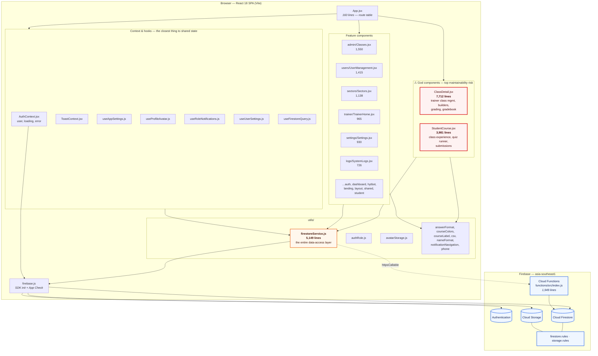
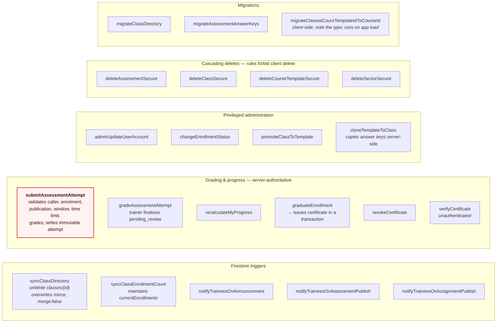
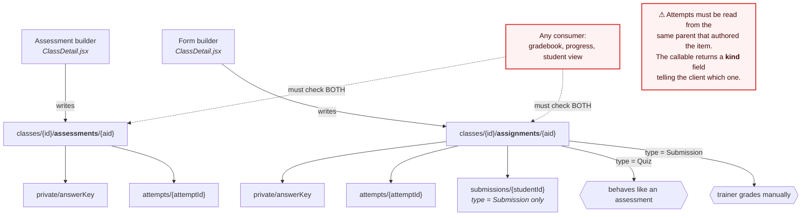
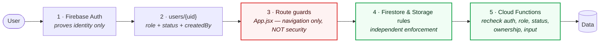

# HYTech LMS — Structure Diagram (as-built)

The clean [class diagram](../mermaid/class-diagram.md) shows a domain model with
`User` subclasses, an abstract `GradedItem`, and encapsulated behaviour. **None
of that exists in the code.** This is a React SPA: there are no domain classes,
no inheritance, and no repository objects. Behaviour lives in components, one
very large service module, and Cloud Functions.

This document shows the real structure. Use it when deciding where to put a
change; use the clean diagram when documenting the design intent.

> Line counts measured on the `security/hardening-remediation` branch.

---

## 1. What actually exists instead of classes

| Clean design says | Reality |
| --- | --- |
| `User` / `Administrator` / `Trainer` / `Student` classes | One `users/{uid}` document with a `role` string; role handled by `if` branches and `authRole.js` helpers |
| `GradedItem` ← `Assessment` / `Assignment` | Two unrelated Firestore collections with overlapping shapes and no shared code path |
| `Class.roster()`, `Enrollment.approve()` | Free functions exported from `firestoreService.js` |
| Repository per aggregate | One 5,149-line `firestoreService.js` |
| `AnswerKey.score()` | Scoring logic inlined in `functions/src/index.js` |
| Encapsulated `Attempt.finalise()` | `gradeAssessmentAttempt` callable |

---

## 2. Module structure

There is **no Redux and no central store**. State lives in component state,
`AuthContext`, `ToastContext`, custom hooks, and Firestore `onSnapshot`
listeners. `firestoreService.js` is the only data-access layer, and everything
imports from it directly — which is why it is 5,149 lines.

---

## 3. Cloud Functions — the real behaviour layer

These are the operations that genuinely cannot be expressed client-side. They
are the closest thing the system has to domain methods.

---

## 4. The dual assessment path, as built

This is the structural wart most likely to cause a bug. There is no shared
abstraction — two builders write to two sibling collections, and every consumer
must handle both.

---

## 5. Access-control layers, as built

Authentication and authorisation are deliberately separate, and each layer
re-checks independently. A route guard is **not** a security control — a hostile
client can call the Firebase APIs directly.

Note the `canUseLms()` waiver in `firestore.rules`: an account with
`createdBy == 'admin'` bypasses the email-verification gate. This is why a
self-registering user must never be able to set that field — the create rule
explicitly forbids it.

---

## 6. If you are refactoring toward the clean model

Rough order of value, cheapest and safest first:

1. **Standardise `status` casing** to lowercase and migrate existing documents —
   removes a whole class of silent query failures.
2. **Extract the graded-item resolver** into one module both builders and all
   consumers call, even before the collections merge.
3. **Collapse the duplicate avatar and name fields** to one canonical each.
4. **Split `ClassDetail.jsx`** along its tabs (roster, content, builders,
   grading, gradebook) — 7,712 lines is the single largest maintenance risk.
5. **Split `firestoreService.js`** per aggregate (users, classes, enrolments,
   assessments, support) — this is the step that makes the clean class diagram
   plausible rather than aspirational.
6. **Retire `classes/{id}/modules`** and the duplicate materials home.
7. **Merge `assessments` and `assignments`** behind a `kind` discriminator. This
   one needs a migration, updated rules, and new indexes — do it last.
