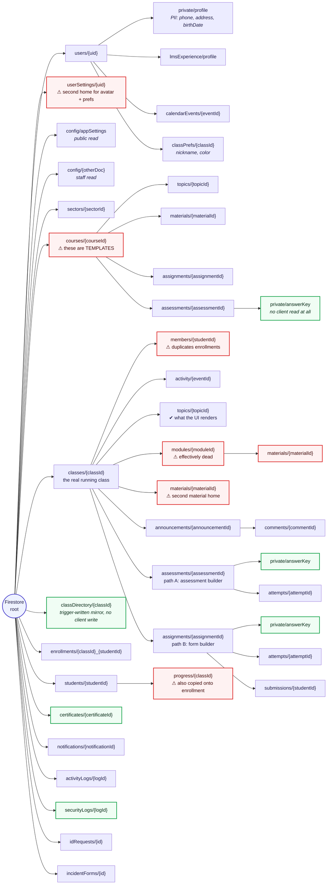
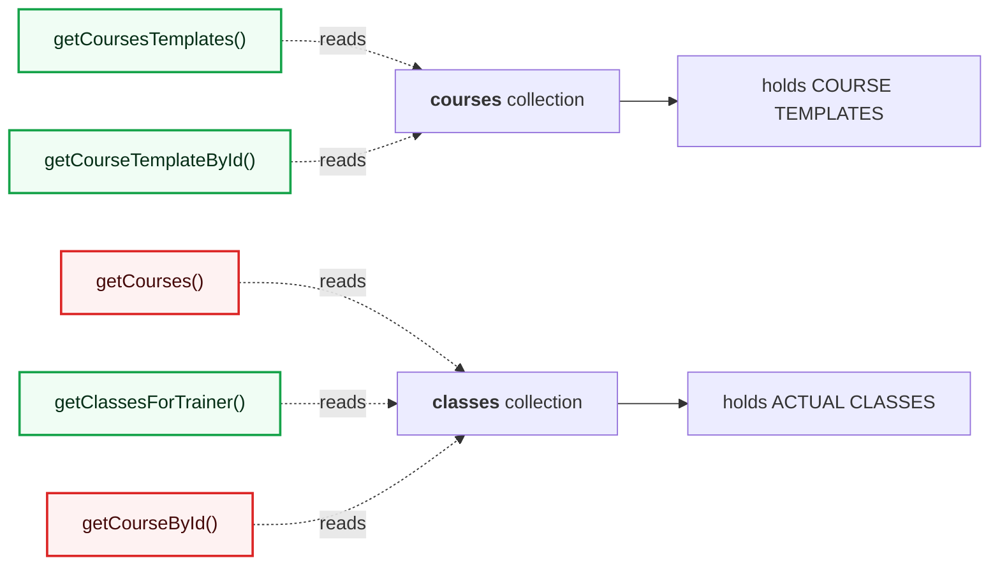
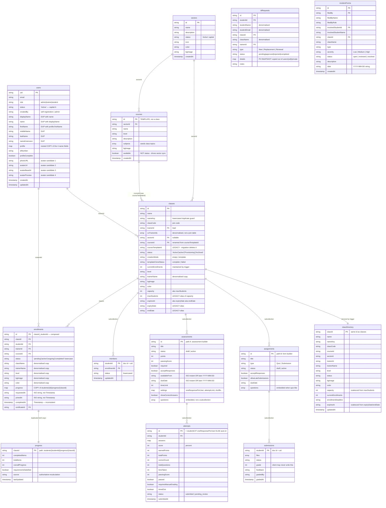
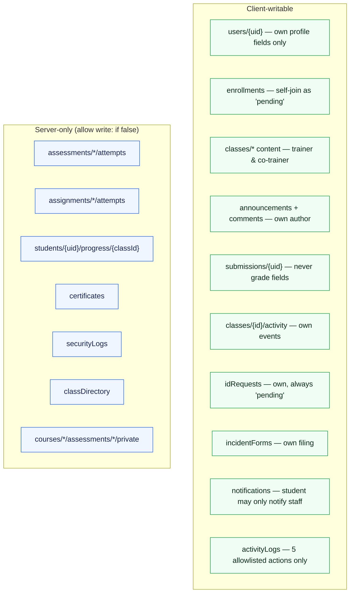

# HYTech LMS — Database Schema (as-built)

This is what is **actually in Firestore today**, including the legacy fields,
duplicated data and confusing names. It is deliberately not tidied up — use it
when you need to write a query, a security rule, or a migration and need to know
what really exists.

The cleaned-up target model is in
[../mermaid/database-schema.md](../mermaid/database-schema.md).

> Verified against `firestore.rules`, `src/utils/firestoreService.js` and
> `functions/src/index.js` on the `security/hardening-remediation` branch.

---

## 1. Actual document tree

---

## 2. The naming trap

This is the single most common source of wrong queries in this codebase:

`getCourses()` and `getCourseById()` read **`classes`**, not `courses`. A course
template only becomes visible on the admin Classes page once a trainer spins a
class up from it — which is exactly the reported "I added a course and it did
not show up" bug (QA item admin#4).

---

## 3. Entities with real field names

---

## 4. Known divergences, ranked by how much they will bite you

| # | Divergence | Where | Consequence |
| --- | --- | --- | --- |
| 1 | **`courses` means templates; `getCourses()` reads `classes`** | `firestoreService.js` | Wrong collection queried; admin#4 "course does not appear" |
| 2 | **Two graded-item collections** — `assessments` (assessment builder) and `assignments` (form builder) | `classes/{id}/…` | Anything resolving a graded item must check **both**, and read attempts from the same parent that authored the item |
| 3 | **`status` casing is split** — 17 occurrences of `'Active'` vs 16 of `'active'` | throughout | Equality queries silently return nothing; rules compensate with `in ['Active','active']` |
| 4 | **Progress stored twice** — `students/{uid}/progress/{classId}` *and* `enrollments.progress` | Cloud Functions | Two sources of truth; only the Function keeps them in step |
| 5 | **Membership stored twice** — `classes/{id}/members/{uid}` *and* `enrollments` | rules + service | `classMember()` accepts either; an orphaned member doc grants access |
| 6 | **Materials have two homes** — `classes/{id}/materials` and `classes/{id}/modules/{id}/materials` | `firestoreService.js` | The `modules` subcollection is effectively dead; the UI renders `topics`. Seeded subjects "vanished" because of this |
| 7 | **Four avatar fields + a fallback collection** — `photoURL`, `avatarUrl`, `avatarBase64`, `avatarPreview`, then `userSettings/{uid}` | users, components | Every avatar read is a coalesce chain |
| 8 | **Name fields duplicated** — flat `firstName…nameExtension` *and* nested `profile.{…}` | `createRegisteredUserProfile` | Updating one and not the other desynchronises the display name |
| 9 | **Legacy field aliases** — `courseTemplateId`→`courseId`, `maxStudents`→`capacity`, `expiryDate`/`endDate`→`expiresAt` | classes | `migrateClassesCoursTemplateIdToCourseId()` (note the typo) runs on app load |
| 10 | **Mixed date storage** — ISO instants, bare `YYYY-MM-DD`, and Firestore `Timestamp` all in use | enrollments, assessments | A bare date resolves to end-of-day for a deadline and start-of-day for an open date; client and Function must apply this identically |
| 11 | **Attempt document ID is conditional** — `studentId` when `oneResponsePerUser`, otherwise auto-ID | `submitAssessmentAttempt` | You cannot assume a stable attempt path |
| 12 | **Questions are embedded arrays**, not a subcollection | assessments, assignments | No per-question query; whole item must be read |
| 13 | **A missed-deadline zero is derived, never stored** | client + Function | "No attempt + deadline passed" ⇒ 0. Do not look for a zero attempt document |
| 14 | **`classDirectory` is overwritten with `merge: false`** by an `onWrite` trigger | `syncClassDirectory` | Any field not in `toClassDirectoryEntry()` is destroyed on every class write |
| 15 | **Deletes are disabled in rules** for sectors, courses, classes, assessments | `firestore.rules` | Deletion only happens through `delete*Secure` Cloud Functions, which cascade |

---

## 5. Write-path reality

Which paths a browser can write is not obvious from the tree, so:

Everything in the right-hand group has **no client write path whatsoever**.
Granting one is a security regression, not a convenience fix — attempts and
certificates are the anti-tampering boundary of the whole grading model.
