# HYTech LMS — Class Diagram (design-level)

Idealised domain model. Roles appear as subclasses even though the
implementation stores a single `role` discriminator on one user document, and
denormalised display copies (`className`, `trainerName`, …) are left out.

For the storage view see [database-schema.md](database-schema.md); for what the
code actually contains today see [../as-built/class-diagram.md](../as-built/class-diagram.md).

```mermaid
classDiagram
    direction TB

    %% ==================== IDENTITY & ACCESS ====================
    namespace Identity {
        class User {
            <<abstract>>
            +String uid
            +String email
            +String displayName
            +String firstName
            +String lastName
            +AccountStatus status
            +Boolean emailVerified
            +ProvisioningSource createdBy
            +DateTime createdAt
            +signIn(credentials) Session
            +updateProfile(changes) void
            +isActive() Boolean
            +role() Role
        }

        class Administrator {
            +createUser(details, role) User
            +setAccountStatus(user, status) void
            +promoteToTrainer(user) void
            +reviewIdRequest(request, decision) void
            +purgeActivityLogs(range) void
        }

        class Trainer {
            +String specialization
            +createClass(template, sector) Class
            +approveEnrollment(enrollment) void
            +publishItem(item) void
            +gradeAttempt(attempt, marks) void
            +graduate(enrollment) Certificate
        }

        class Student {
            +String idNumber
            +joinClassByCode(code) Enrollment
            +submitAttempt(item, answers) Attempt
            +submitDeliverable(assignment, files) Submission
            +requestIdCard(details) IdRequest
        }

        class PrivateProfile {
            <<PII>>
            +String phone
            +String address
            +Date birthDate
            +String emergencyContact
        }

        class LmsExperience {
            +String headline
            +String about
            +List~String~ skills
            +List~String~ certifications
            +Visibility visibility
        }

        class AppSettings {
            <<singleton>>
            +Branding branding
            +Boolean allowSelfRegistration
            +Boolean requireEnrollmentApproval
            +selfRegistrationAllowed() Boolean
            +enrollmentApprovalRequired() Boolean
        }
    }

    %% ==================== CATALOGUE ====================
    namespace Catalogue {
        class Sector {
            +String sectorId
            +String name
            +String description
            +String icon
            +PublicationStatus status
            +activate() void
            +listTemplates() List~CourseTemplate~
        }

        class CourseTemplate {
            +String courseId
            +String name
            +QualificationLevel level
            +String description
            +List~String~ subjects
            +Boolean available
            +hasFullContent() Boolean
            +cloneInto(target) void
        }
    }

    %% ==================== CLASS DELIVERY ====================
    namespace Delivery {
        class Class {
            +String classId
            +String name
            +String classCode
            +QualificationLevel level
            +String schedule
            +ClassStatus status
            +CreationMode creationMode
            +Integer currentEnrollments
            +generateClassCode() String
            +addCoTrainer(t) void
            +transferOwnership(t) void
            +roster() List~Student~
            +archive() void
        }

        class Topic {
            +String topicId
            +String title
            +Integer order
            +Boolean isPublished
        }

        class Material {
            +String materialId
            +String title
            +String fileUrl
            +String fileType
            +Long fileSize
            +String externalLink
            +download() Blob
        }

        class Announcement {
            +String announcementId
            +String title
            +String message
            +List~Attachment~ attachments
            +edit(message) void
        }

        class Comment {
            +String commentId
            +String message
            +DateTime postedAt
        }

        class ActivityEvent {
            <<immutable>>
            +String eventId
            +EngagementType type
            +DateTime occurredAt
        }
    }

    %% ==================== ASSESSMENT ====================
    namespace Assessment {
        class GradedItem {
            <<abstract>>
            +String itemId
            +String title
            +Integer points
            +Integer passingScore
            +PublicationStatus status
            +Boolean acceptResponses
            +Boolean required
            +DateTime availableFrom
            +DateTime dueAt
            +Integer timeLimitMinutes
            +Integer attemptLimit
            +Boolean oneResponsePerUser
            +Boolean allowLateSubmissions
            +publish() void
            +isOpen(at) Boolean
            +isOverdue(at) Boolean
            +evaluate(student) Result
        }

        class AssessmentItem {
            +Boolean shuffleQuestions
            +Boolean showCorrectAnswers
            +evaluate(student) Result
        }

        class AssignmentItem {
            +AssignmentType type
            +evaluate(student) Result
        }

        class Question {
            +String questionId
            +QuestionType type
            +String prompt
            +List~String~ options
            +Integer points
            +isAutoGradable() Boolean
        }

        class AnswerKey {
            <<restricted>>
            +Map correctAnswers
            +String rubric
            +score(answers) ScoreBreakdown
        }

        class Attempt {
            <<immutable>>
            +String attemptId
            +Integer score
            +Integer earnedPoints
            +Integer totalPoints
            +Integer timeTaken
            +Boolean passed
            +Boolean requiresManualGrading
            +Boolean timedOut
            +AttemptStatus status
            +DateTime submittedAt
            +finalise(marks, feedback) void
        }

        class Submission {
            +String studentId
            +List~Attachment~ files
            +DateTime submittedAt
            +Integer grade
            +String feedback
            +SubmissionStatus status
            +isLate(item) Boolean
        }
    }

    %% ==================== RECORDS ====================
    namespace Records {
        class Enrollment {
            +String enrollmentId
            +EnrollmentStatus status
            +DateTime requestedAt
            +DateTime joinedAt
            +DateTime completedAt
            +approve() void
            +reject(reason) void
            +graduate() Certificate
            +withdraw() void
        }

        class Progress {
            <<derived>>
            +Integer completedItems
            +Integer totalItems
            +Integer overallProgress
            +Boolean requirementsSatisfied
            +recalculate() Progress
        }

        class Certificate {
            <<immutable>>
            +String certificateId
            +String certificateNumber
            +String verificationToken
            +CertificateStatus status
            +DateTime issuedAt
            +verify(token) VerificationResult
            +revoke(reason) void
        }
    }

    %% ==================== SUPPORT & COMPLIANCE ====================
    namespace Support {
        class IdRequest {
            +String requestId
            +IdRequestType type
            +IdCardDetails details
            +RequestStatus status
            +approve(reviewer) void
            +reject(reviewer, reason) void
            +complete(reviewer) void
        }

        class IncidentForm {
            +String incidentId
            +String type
            +Severity severity
            +String description
            +IncidentStatus status
            +advanceTo(status, reviewer) void
        }

        class Notification {
            +String notificationId
            +String type
            +String text
            +Boolean unread
            +markRead() void
        }

        class ActivityLog {
            <<append-only>>
            +String logId
            +ActivityAction action
            +String entityType
            +String entityId
            +DateTime timestamp
        }

        class SecurityLog {
            <<append-only>>
            +String logId
            +String actorUid
            +Role actorRole
            +String action
            +DateTime timestamp
        }
    }

    %% ==================== INHERITANCE ====================
    User <|-- Administrator
    User <|-- Trainer
    User <|-- Student
    GradedItem <|-- AssessmentItem
    GradedItem <|-- AssignmentItem

    %% ==================== COMPOSITION ====================
    User "1" *-- "1" PrivateProfile
    User "1" *-- "0..1" LmsExperience

    Class "1" *-- "0..*" Topic
    Class "1" *-- "0..*" Material
    Class "1" *-- "0..*" Announcement
    Class "1" *-- "0..*" ActivityEvent
    Announcement "1" *-- "0..*" Comment
    Topic "1" o-- "0..*" Material : groups

    Class "1" *-- "0..*" GradedItem
    GradedItem "1" *-- "0..*" Question
    GradedItem "1" *-- "0..1" AnswerKey
    GradedItem "1" *-- "0..*" Attempt
    AssignmentItem "1" *-- "0..*" Submission

    Enrollment "1" *-- "1" Progress
    Enrollment "1" o-- "0..1" Certificate

    %% ==================== ASSOCIATIONS ====================
    Sector "1" o-- "0..*" CourseTemplate : categorises
    Sector "0..1" <-- "0..*" Class : categorised by
    CourseTemplate "0..1" <.. Class : instantiated from

    Trainer "1" --> "0..*" Class : leads
    Trainer "0..*" -- "0..*" Class : co-teaches

    Student "1" -- "0..*" Enrollment
    Class "1" -- "0..*" Enrollment

    Student "1" -- "0..*" Attempt : produces
    Student "1" -- "0..*" Submission : produces
    Student "1" -- "0..*" ActivityEvent : generates
    Trainer "1" -- "0..*" Attempt : finalises
    Trainer "1" -- "0..*" Submission : grades

    User "1" -- "0..*" Announcement : authors
    User "1" -- "0..*" Comment : authors
    User "1" -- "0..*" Notification : receives
    User "1" -- "0..*" ActivityLog : generates
    User "1" -- "0..*" IncidentForm : files
    Student "1" -- "0..*" IdRequest : raises
    Administrator "1" -- "0..*" IdRequest : adjudicates

    %% ==================== NOTES ====================
    note for AnswerKey "Never delivered to a learner's browser; read only by the grading service."
    note for Attempt "Created exclusively by the grading service. Clients cannot create or alter an attempt."
    note for Progress "Derived from required items and passing evidence, not authored."
    note for PrivateProfile "Segregated so a roster read cannot expose contact details."
```

## Enumerations

```mermaid
classDiagram
    direction LR

    class Role {
        <<enumeration>>
        ADMIN
        TRAINER
        STUDENT
    }
    class AccountStatus {
        <<enumeration>>
        ACTIVE
        INACTIVE
        SUSPENDED
    }
    class ProvisioningSource {
        <<enumeration>>
        SELF_REGISTRATION
        ADMIN
    }
    class ClassStatus {
        <<enumeration>>
        DRAFT
        PROVISIONING
        ACTIVE
        ARCHIVED
    }
    class CreationMode {
        <<enumeration>>
        EMPTY
        TEMPLATE
    }
    class PublicationStatus {
        <<enumeration>>
        DRAFT
        ACTIVE
        CLOSED
    }
    class EnrollmentStatus {
        <<enumeration>>
        PENDING
        ACTIVE
        ONGOING
        COMPLETED
        REJECTED
    }
    class QuestionType {
        <<enumeration>>
        MULTIPLE_CHOICE
        CHECKBOX
        TRUE_FALSE
        SHORT_ANSWER
        PARAGRAPH
    }
    class AttemptStatus {
        <<enumeration>>
        SUBMITTED
        PENDING_REVIEW
        GRADED
    }
    class SubmissionStatus {
        <<enumeration>>
        SUBMITTED
        ACCEPTED
        RETURNED
    }
    class AssignmentType {
        <<enumeration>>
        QUIZ
        SUBMISSION
    }
    class QualificationLevel {
        <<enumeration>>
        NC_I
        NC_II
        NC_III
        NC_IV
    }
    class RequestStatus {
        <<enumeration>>
        PENDING
        APPROVED
        REJECTED
        COMPLETED
    }
    class IncidentStatus {
        <<enumeration>>
        OPEN
        REVIEWED
        RESOLVED
    }
    class Severity {
        <<enumeration>>
        LOW
        MEDIUM
        HIGH
    }
    class CertificateStatus {
        <<enumeration>>
        VALID
        REVOKED
    }
```

## Stereotype key

| Stereotype | Meaning |
| --- | --- |
| `<<immutable>>` | Written once by trusted server code; clients cannot modify |
| `<<restricted>>` | Never transmitted to a learner's client |
| `<<derived>>` | Computed from other entities, not authored |
| `<<append-only>>` | Audit record; no update path |
| `<<PII>>` | Personally identifiable information, access-segregated |
