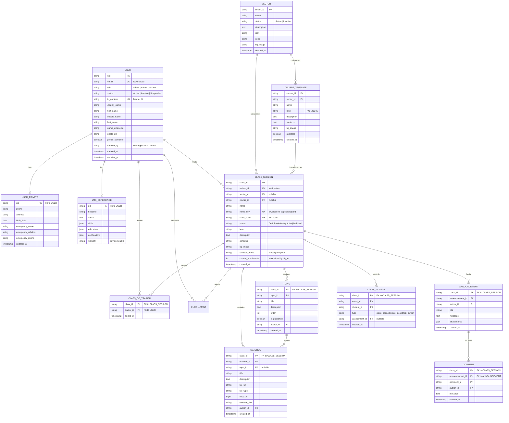
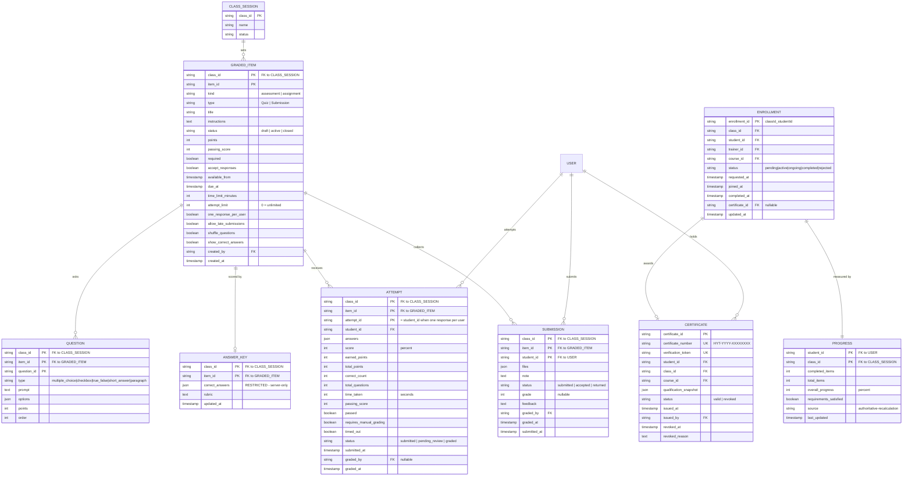

# HYTech LMS — Database Schema (design-level)

The production store is Cloud Firestore, a document database. This is the
**normalised logical schema** — one entity per concept, explicit keys, no
denormalised display copies. It is the model to reason about and the model to
migrate toward, not a literal dump of the collections.

For the literal as-built layout, including legacy fields and duplicated data,
see [../as-built/database-schema.md](../as-built/database-schema.md).

## Core: identity, catalogue, delivery

## Assessment, grading and records

## Support, messaging and audit

```mermaid
erDiagram
    USER ||--o{ ID_REQUEST : "raises"
    USER ||--o{ INCIDENT_FORM : "files"
    USER ||--o{ NOTIFICATION : "receives"
    USER ||--o{ ACTIVITY_LOG : "generates"
    USER ||--o{ SECURITY_LOG : "is subject of"
    USER ||--o{ CALENDAR_EVENT : "owns"
    USER ||--o{ CLASS_PREFERENCE : "sets"
    CLASS_SESSION ||--o{ ID_REQUEST : "context for"
    CLASS_SESSION ||--o{ INCIDENT_FORM : "context for"
    CLASS_SESSION ||--o{ CLASS_PREFERENCE : "styled by"

    USER {
        string uid PK
        string role
        string status
    }

    CLASS_SESSION {
        string class_id PK
        string name
    }

    ID_REQUEST {
        string request_id PK
        string student_id FK
        string class_id FK
        string trainer_id FK
        string type "New | Replacement | Renewal"
        string status "pending|approved|rejected|completed"
        json details "PII snapshot - owner and admin only"
        text notes
        string reviewed_by FK
        timestamp reviewed_at
        timestamp created_at
    }

    INCIDENT_FORM {
        string incident_id PK
        string filed_by FK
        string filed_by_role "admin | trainer | student"
        string involved_student_id FK
        string class_id FK
        string type
        string severity "Low | Medium | High"
        string status "open | reviewed | resolved"
        text description
        date occurred_on
        string reviewed_by FK
        timestamp reviewed_at
        timestamp created_at
    }

    NOTIFICATION {
        string notification_id PK
        string to_uid FK
        string from_uid FK
        string type
        text message
        json metadata
        boolean unread
        timestamp created_at
    }

    ACTIVITY_LOG {
        string log_id PK
        string user_id FK
        string action "user_signup|user_login|join_class|id_request|incident_filed"
        string entity_type
        string entity_id
        json metadata
        timestamp created_at
    }

    SECURITY_LOG {
        string log_id PK
        string actor_uid FK
        string actor_role
        string action
        string entity_type
        string entity_id
        json metadata
        timestamp created_at
    }

    CALENDAR_EVENT {
        string uid PK "FK to USER"
        string event_id PK
        string title
        text description
        timestamp starts_at
        timestamp ends_at
    }

    CLASS_PREFERENCE {
        string uid PK "FK to USER"
        string class_id PK "FK to CLASS_SESSION"
        string nickname "max 100 chars"
        string color "allowlisted gradient"
        timestamp updated_at
    }

    APP_SETTINGS {
        string id PK "always 'appSettings'"
        json branding
        boolean allow_self_registration
        boolean require_enrollment_approval
        json notification_toggles
        timestamp updated_at
    }
```

## Design notes

**Composite keys reflect physical nesting.** Firestore stores topics, materials,
graded items, attempts and submissions as child documents of their class, so the
parent identifier is genuinely part of the key rather than a conventional
foreign key alone.

**`enrollment_id` is deterministic:** `{class_id}_{student_id}`. In a store with
no unique constraints, that composed document ID is what enforces one enrolment
per learner per class.

**`GRADED_ITEM` unifies two collections.** The application currently splits quiz
authoring across sibling `assessments` and `assignments` collections; the
`kind` discriminator collapses them. This is the single biggest simplification
this model proposes over the as-built schema.

**Three tables are server-write-only:** `ATTEMPT`, `CERTIFICATE` and
`SECURITY_LOG` have no client write path at all, and `PROGRESS` is derived. Any
design that lets a browser write these is a security regression.
