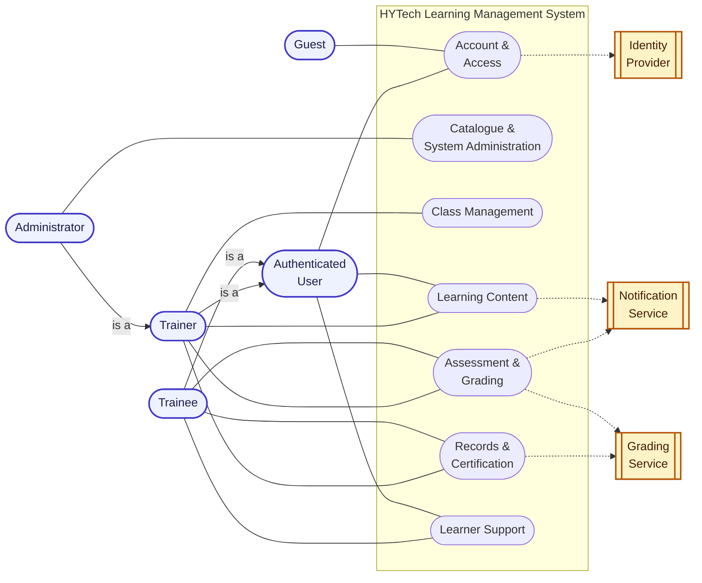
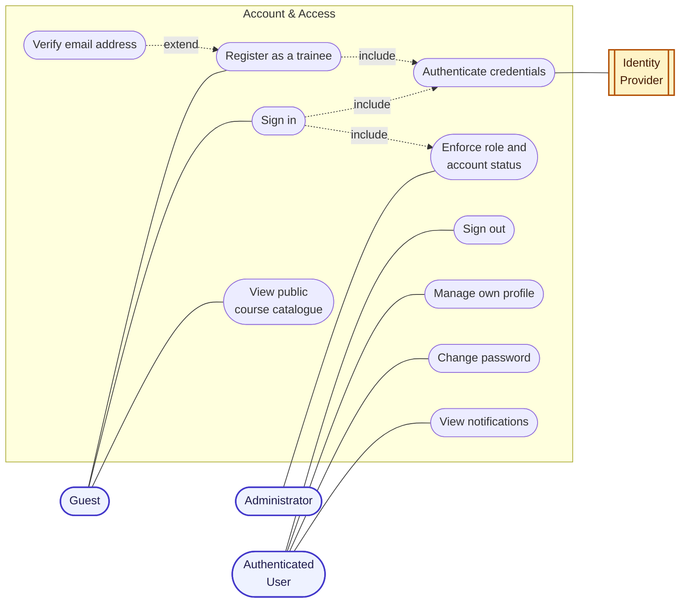
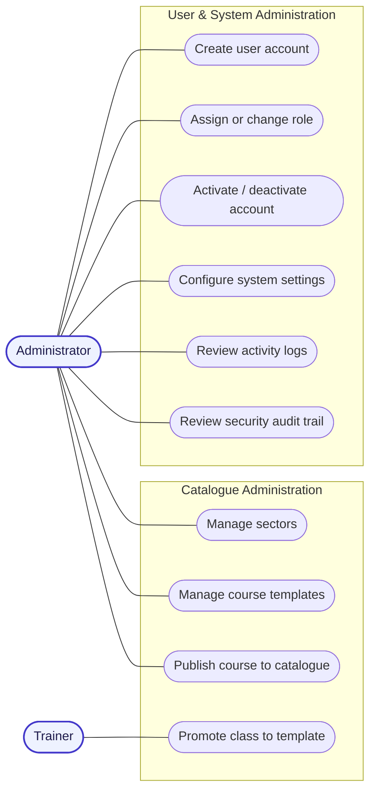
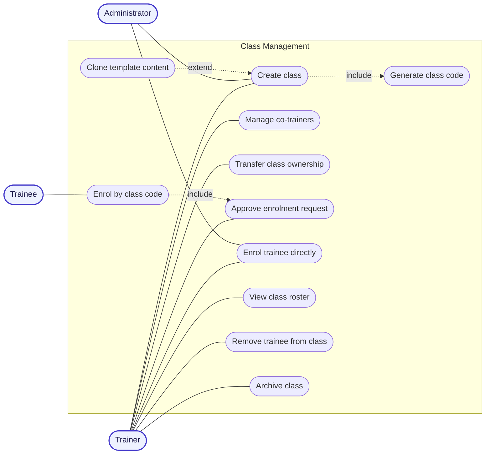
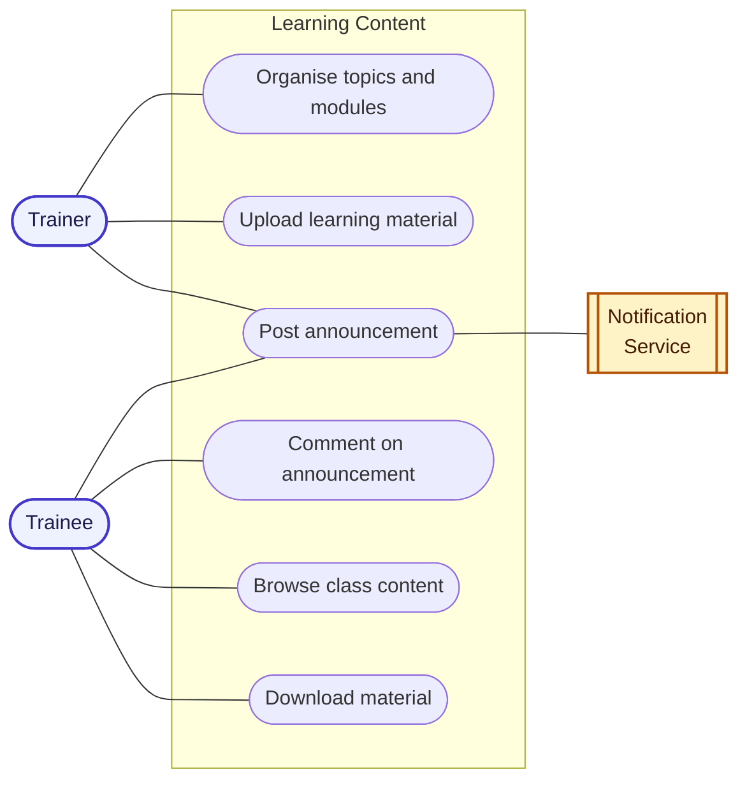
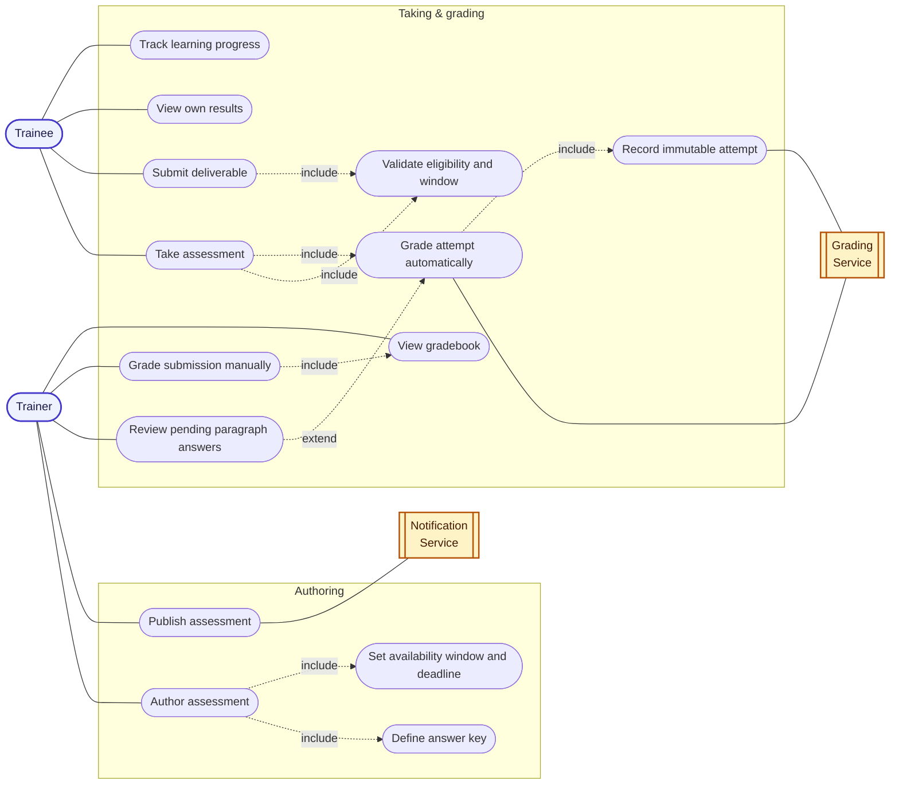
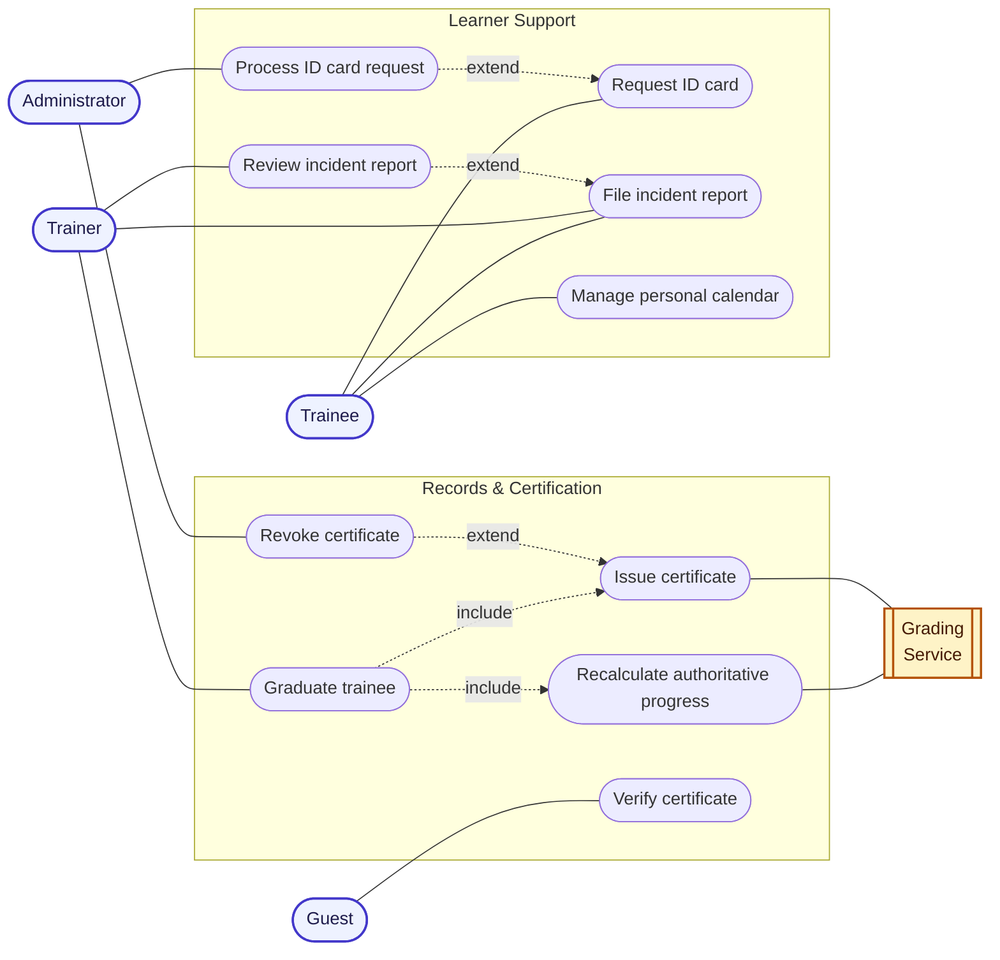

# HYTech LMS — Use Case Diagrams (design-level)

Mermaid has no native use-case diagram type, so these use flowcharts with the
conventional layout: actors outside, the system boundary as a subgraph,
`<<include>>` / `<<extend>>` as dashed edges.

Split into a context view plus six focused diagrams — a single frame holding all
sixty-odd use cases is unreadable at any zoom level.

Actor generalisation applies throughout: every role is an **Authenticated
User**, and an **Administrator** inherits everything a **Trainer** can do. Each
sub-diagram repeats only the actors it needs.

---

## 0 · Actors and capability areas

---

## 1 · Account & Access

Self-registration always produces a **student**. Trainer and admin accounts are
created or promoted by an administrator, and self-registration can be disabled
entirely in system settings.

*Enforce role and account status* is included by sign-in, but it is
independently re-applied by the security rules and by every privileged server
operation. A route guard on its own is never the control.

---

## 2 · Catalogue & System Administration

*Configure system settings* controls self-registration and whether enrolment
requires trainer approval — both change how other use cases behave.

---

## 3 · Class Management

*Enrol by class code* includes approval under the default policy. When an
administrator turns enrolment approval off, the enrolment activates immediately
and the approval step is skipped.

*Clone template content* copies content **server-side** so private answer keys
never reach the trainer's browser.

Co-trainers gain full content powers; managing co-trainers and transferring
ownership stay with the lead trainer.

---

## 4 · Learning Content

Trainees may post to the class feed and edit their own post. Staff may remove an
inappropriate post but cannot rewrite someone else's.

---

## 5 · Assessment & Grading

**Grading is server-authoritative.** A trainee never scores their own work.
*Take assessment* hands answers to the Grading Service, which owns scoring and
writes an attempt the client can neither create nor alter. Paragraph answers
land in a pending state and are finalised by a trainer.

*Validate eligibility and window* checks caller, enrolment, publication state,
availability window, attempt limit and time limit. A missed deadline scores zero
without any stored attempt.

Correct answers live in a private document, never in the trainee-readable
assessment.

---

## 6 · Records, Certification & Learner Support

*Graduate trainee* refuses unless every required item is satisfied by
recalculated progress; certificate issue and enrolment completion happen in one
transaction.

A trainer may only move an incident report through the workflow — they cannot
rewrite the incident details. ID card requests are handled by an administrator;
the trainer is not involved.
